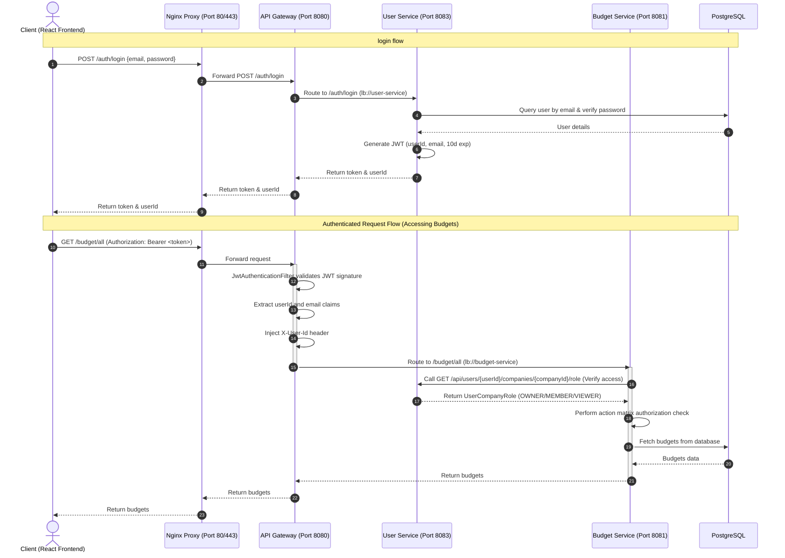

# End-to-End Authentication and Authorization Flow (JWT & OAuth2)

## 1. Overview

**Artha** uses a decentralized, token-based authentication and authorization architecture to secure its distributed microservices. By combining an edge reverse proxy (Nginx), an API Gateway (Spring Cloud Gateway), a specialized Identity Provider (User Service), and downstream resource controllers, the system achieves robust security, minimal database lookup overhead, and strict access control.

The security system is based on two primary paradigms:
- **Authentication (AuthN)**: Handled via local credentials (email/password) or Google OAuth2 Single Sign-On (SSO). Successful login generates a stateless JSON Web Token (JWT) signed by a symmetric key.
- **Authorization (AuthZ)**: Divided into two layers:
  1. **Edge/Gateway Level**: The Gateway validates the JWT signature and extracts the user identity, sanitizing request headers.
  2. **Service Level**: Downstream services trust the Gateway-injected headers but check user roles within companies (`OWNER`, `MEMBER`, `VIEWER`) via a remote call to the User Service before executing operations.

---

## 2. System Architecture

The traffic flow from the client to the database is shown in the diagram below:



---

## 3. Nginx Edge Reverse Proxy Role

Nginx acts as the boundary gateway at the edge of the infrastructure. Its role is strictly infrastructural and focuses on transport-level routing rather than application security.

### 3.1 Key Responsibilities
1. **SSL/TLS Termination**: Terminates external HTTPS requests on port 443 using Let's Encrypt certificates (`fullchain.pem` and `privkey.pem`) and routes them as plain HTTP over the internal docker network.
2. **Edge Rate Limiting**: Employs an IP-based rate limiting zone (`limit_req_zone $binary_remote_addr zone=api:10m rate=10r/s`) with a burst limit of 20 requests and no delay. This prevents DDoS attacks before they hit the Java/Python runtimes.
3. **Gateway Forwarding**: Proxies all traffic using standard headers (`X-Real-IP`, `X-Forwarded-For`, `X-Forwarded-Proto`) to the upstream `api-gateway` on port 8080.

> [!NOTE]
> Nginx **does not** touch or validate JWT headers. Security headers (such as `X-Frame-Options` and CORS settings) are deliberately deferred to the API Gateway to prevent duplicate header conflicts.

---

## 4. JSON Web Token (JWT) Role & Design

JWTs serve as the stateless session tokens for the application, enabling decentralized verification across services.

### 4.1 Token Structure
The token is a standard three-part string (Header, Payload, Signature) signed symmetrically using **HMAC-SHA256** with a shared secret key configured as `jwt.secret`.

The payload contains the following claims:
- **`sub` (Subject)**: The authenticated user's email address (e.g., `user@example.com`).
- **`userId` (Custom Claim)**: The unique UUID string of the user in the PostgreSQL database.
- **`iat` (Issued At)**: Unix timestamp when the token was created.
- **`exp` (Expiration)**: Expiration timestamp set to **10 days** (864,000 seconds) after generation.

### 4.2 Decoupled Verification
The User Service acts as the **Identity Provider (IdP)** that generates tokens upon credentials login or Google SSO callbacks. The API Gateway and all microservices share the same `jwt.secret`. This allows the Gateway to verify token signatures independently without making synchronous API calls to the User Service database.

---

## 5. API Gateway Security Layer

The API Gateway (Spring Cloud Gateway) is the gatekeeper for the microservice mesh. It validates credentials, enforces security rules, and sanitizes headers.

### 5.1 Security Configuration (`SecurityConfig.java`)
The Gateway uses **Spring WebFlux Security** for reactive, non-blocking connection handling.

- **CSRF**: Disabled since the application is stateless and relies on JWT tokens rather than cookies.
- **CORS**: Configured dynamically to read allowed origins from the environment (`ALLOWED_ORIGINS` defaults to `http://localhost:5173`).
- **Access Rules**:
  - Public routes (`/auth/**`, `/users/auth/**`, `/oauth2/**`, `/login/oauth2/**`, `/internal/**`, `/actuator/**`) bypass authentication.
  - All other routes require authentication.

### 5.2 JWT Authentication Filter (`JwtAuthenticationFilter.java`)
The `JwtAuthenticationFilter` intercepts incoming requests, validates tokens, and injects authenticated user data:

```java
@Override
public Mono<Void> filter(ServerWebExchange exchange, WebFilterChain chain) {
    ServerHttpRequest request = exchange.getRequest();
    String authHeader = request.getHeaders().getFirst(HttpHeaders.AUTHORIZATION);

    if (authHeader != null && authHeader.startsWith("Bearer ")) {
        String token = authHeader.substring(7);

        if (jwtUtil.validateToken(token)) {
            String email = jwtUtil.getEmailFromToken(token);
            String userId = jwtUtil.getUserIdFromToken(token);

            UsernamePasswordAuthenticationToken auth = new UsernamePasswordAuthenticationToken(
                    email, null, Collections.emptyList()
            );

            // Mutate the incoming request to inject the X-User-Id header.
            // This sanitizes the request, overriding any spoofed client headers.
            ServerHttpRequest.Builder requestBuilder = request.mutate();
            if (userId != null) {
                requestBuilder.header("X-User-Id", userId);
            }
            ServerHttpRequest mutatedRequest = requestBuilder.build();

            ServerWebExchange mutatedExchange = exchange.mutate()
                    .request(mutatedRequest)
                    .build();

            return chain.filter(mutatedExchange)
                    .contextWrite(ReactiveSecurityContextHolder.withAuthentication(auth));
        }
    }
    return chain.filter(exchange);
}
```

> [!IMPORTANT]
> **Header Injection & Sanitization**: The Gateway mutates the HTTP request to append or overwrite the `X-User-Id` header. This is a critical security boundary: even if a malicious client attempts to spoof identity by sending their own `X-User-Id` header, the Gateway's filter overwrites it with the value extracted from the signature-verified JWT.

---

## 6. User Service: Local Auth and Google OAuth2 SSO

The User Service manages user profiles, passwords, and oauth clients. It generates JWTs and exposes role-checking endpoints to downstream services.

### 6.1 Local Credentials Authentication
- **Signup (`/auth/signup`)**: Receives registration requests, checks if the email is in use, hashes the password using `BCryptPasswordEncoder`, and creates the user record.
- **Login (`/auth/login`)**: Validates credentials via Spring Security's `AuthenticationManager` and invokes `jwtUtil.generateAccessToken(user)` to return the token to the client.

### 6.2 Google OAuth2 SSO Flow
The application integrates Google OAuth2 using the standard Spring Boot Starter Security OAuth2 client.

```yaml
# Configuration properties in user-service/src/main/resources/application.properties
spring.security.oauth2.client.registration.google.client-id=${GOOGLE_CLIENT_ID}
spring.security.oauth2.client.registration.google.client-secret=${GOOGLE_CLIENT_SECRET}
spring.security.oauth2.client.registration.google.scope=email,profile
spring.security.oauth2.client.registration.google.redirect-uri={baseUrl}/login/oauth2/code/google
```

When a user initiates OAuth2 login:
1. The user navigates to `/oauth2/authorization/google` on the API Gateway, which routes the request to the User Service.
2. The User Service redirects the browser to Google's authentication page.
3. Upon successful Google authentication, the browser is redirected back to the callback endpoint `/login/oauth2/code/google`.
4. Spring Security intercepts the authorization code, exchanges it for user information, and invokes `OAuth2AuthenticationSuccessHandler`.

### 6.3 OAuth2 Success Handler (`OAuth2AuthenticationSuccessHandler.java`)
The success handler handles registration for new SSO users and issues tokens:

```java
@Override
public void onAuthenticationSuccess(HttpServletRequest request, HttpServletResponse response,
                                    Authentication authentication) throws IOException, ServletException {
    
    OAuth2User oAuth2User = (OAuth2User) authentication.getPrincipal();
    String email = oAuth2User.getAttribute("email");
    String name = oAuth2User.getAttribute("name");
    String providerId = oAuth2User.getAttribute("sub"); // Google unique ID

    Optional<User> userOptional = userRepository.findByEmail(email);
    User user;

    if (userOptional.isPresent()) {
        user = userOptional.get();
        if (user.getProvider() == null) {
            user.setProvider("google");
            user.setProviderId(providerId);
            userRepository.save(user);
        }
    } else {
        // Auto-register new OAuth2 user
        user = User.builder()
                .email(email)
                .fullName(name)
                .provider("google")
                .providerId(providerId)
                .active(true)
                .build();
        
        user = userRepository.save(user);
        // Provision default company for workspace
        userService.ensurePersonalCompany(user.getId());
    }

    // Generate JWT access token
    String token = jwtUtil.generateAccessToken(user);

    // Redirect the browser to the frontend callback URL with the JWT
    String targetUrl = UriComponentsBuilder.fromUriString(frontendUrl + "/oauth-callback")
            .queryParam("token", token)
            .build().toUriString();

    getRedirectStrategy().sendRedirect(request, response, targetUrl);
}
```

---

## 7. Downstream Microservice Authorization Pattern

Downstream microservices (such as `budget-service` and `expense-service`) do not validate JWTs directly. Instead, they rely on a zero-trust architecture where the Gateway has verified identity, and the services enforce fine-grained domain-level authorization based on user membership within companies.

### 7.1 Security Config in Microservices (`SecurityConfig.java`)
At the Spring Security level, all HTTP requests are permitted because they reside within the private network behind the Gateway firewall.

```java
@Bean
public SecurityFilterChain securityFilterChain(HttpSecurity http) throws Exception {
    http
        .csrf(AbstractHttpConfigurer::disable)
        .sessionManagement(session -> session.sessionCreationPolicy(SessionCreationPolicy.STATELESS))
        .authorizeHttpRequests(auth -> auth.anyRequest().permitAll());
    return http.build();
}
```

### 7.2 Controller Header Extraction
Microservice controllers extract the client identity using the `@RequestHeader` annotation:

```java
@GetMapping("/all")
public ResponseEntity<List<BudgetResponseDTO>> getAllBudgets(
        @RequestHeader("X-User-Id") String userId,
        @RequestParam String companyId) {
    return ResponseEntity.ok(budgetService.getAllBudgets(userId, companyId));
}
```

### 7.3 Action Matrix & Remote Authorization
Inside the service layer (e.g., `BudgetServiceImpl`), authorization is delegated to the `AuthorizationService` (implemented by `RemoteAuthorizationService`).

This service verifies the user's role in the company by calling the User Service through Eureka using `UserServiceClient`:

```java
@Override
public void checkPermission(String userId, String companyId, Action action) {
    if (userId == null || companyId == null) {
        throw new AccessDeniedException("Missing userId or companyId for authorization");
    }

    // Call user-service internally to fetch role
    UserCompanyRole role = userServiceClient.getUserRole(userId, companyId);
    if (role == null) {
        throw new AccessDeniedException("User is not a member of this company");
    }

    if (!isActionAllowed(role, action)) {
        throw new AccessDeniedException("User role " + role + " is not authorized to perform " + action);
    }
}
```

### 7.4 Action Matrix Permission Table
The static mappings inside `isActionAllowed` determine authorization constraints:

| Role | Allow View | Allow Create / Update | Allow Delete |
|---|---|---|---|
| **`OWNER`** | Yes | Yes | Yes |
| **`MEMBER`** | Yes | Yes | No |
| **`VIEWER`** | Yes | No | No |

- `MEMBER` is blocked from `Action.DELETE_BUDGET` and `Action.DELETE_EXPENSE`.
- `VIEWER` is only allowed `Action.VIEW_BUDGET` and `Action.VIEW_EXPENSE`.

---

## 8. Token Propagation and Internal Calls

When services communicate with each other, they must propagate credentials to maintain authorization context.

### 8.1 REST Client Header Propagation
For synchronous REST calls, the calling service injects the `X-User-Id` and `Authorization` headers manually. For example, in the Python-based `analysis-service` calling the budget-service:

```python
async def fetch_company_health_data(company_id: str, headers: dict, db_client: AsyncIOMotorClient) -> dict:
    async with httpx.AsyncClient() as client:
        # Propagation of headers dictionary containing X-User-Id and Authorization
        budgets_resp = await client.get(
            f"{API_GATEWAY_URL}/internal/budget/api/budgets/all",
            params={"companyId": company_id},
            headers=headers,
            timeout=5.0
        )
```

### 8.2 Internal Route Bypass (`/internal/**`)
Gateway routes defined as `/internal/**` (e.g., `/internal/budget/**`) are designated for service-to-service communication.
- These routes **bypass rate limiting** (configured without `RequestRateLimiter` filters in the Gateway configurations).
- Downstream services register these paths in their permitted list to bypass client JWT checks, allowing trusted services (like `analysis-service`) to retrieve cross-domain metadata.

---

## 9. Observability and Troubleshooting

### 9.1 JWT Verification and Debugging
If a frontend request fails with `401 Unauthorized`, you can debug the token structure using standard tools:
1. Copy the token from browser local storage (`artha_jwt`).
2. Decode the Base64 payload component (the middle part separated by dots) to inspect the claims:
   ```bash
   # Decode payload
   echo "eyJ1c2VySWQiOiJ1dWlkLTEyMyIsICJzdWIiOiJ1c2VyQGV4YW1wbGUuY29tIn0=" | base64 --decode
   ```
3. Ensure that `exp` is in the future and `userId` matches the database UUID.

### 9.2 Log Tracing
To trace auth-related issues in the container logs:
- **API Gateway Logs**: Look for `JwtAuthenticationFilter` trace messages. If signature validation fails, verify that the environment variable `JWT_SECRET` matches between `user-service` and `api-gateway`.
- **User Service Logs**: Look for `OAuth2 login success` print lines in the container logs to verify that Google accounts are mapping correctly to system users.
- **Downstream Logs**: Look for `AccessDeniedException` messages to determine if a request failed due to user-company role mismatches.

---

## 10. Security Trade-offs and Future Enhancements

### 10.1 Trade-off: Symmetric Secret vs Asymmetric Keypair
- **Current State**: The system uses a shared symmetric secret (`jwt.secret`) across the gateway and user service. This requires keeping the secret securely in sync across configuration files.
- **Improvement**: Migrate to asymmetric signing (**RS256**). The User Service would sign tokens using a private key, and the API Gateway/downstream services would verify the signature using a public key exposed via a JSON Web Key Set (JWKS) endpoint (`/oauth2/jwks`).

### 10.2 Trade-off: Synchronous Role Querying
- **Current State**: Microservices call the User Service synchronously via RestTemplate for every single action check. While robust, this adds network latency and creates a tight runtime dependency.
- **Improvement**: Include company role assignments directly inside the JWT as custom claims (e.g. `roles: {"comp-123": "OWNER", "comp-456": "VIEWER"}`). This would allow microservices to validate permissions locally without any service-to-service queries, resulting in lower API latency.
