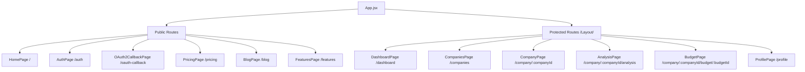

# 🎨 Frontend Architecture & Implementation

This document provides a comprehensive overview of the **Artha Frontend** application (`artha-frontend`). It details the technologies, libraries, component structure, state management, custom hooks, API communication, and centralized error-handling system.

---

## 1. Technology Stack & Packages

The frontend is built as a single-page application (SPA) using React and Vite, utilizing TailwindCSS for styling and Framer Motion for premium fluid interactions.

### 1.1 Core Technologies
- **React (v18.3.1)**: Component-based UI framework.
- **Vite (v5.4.19)**: Build tool and development server providing fast Hot Module Replacement (HMR).
- **TailwindCSS (v3.4.17)**: Utility-first CSS framework for layout and styling.

### 1.2 Key Dependencies (`package.json`)
- **Routing**: `react-router-dom` (v6.30) for declarative, dynamic path matching.
- **HTTP Client**: `axios` (v1.18.0) for API requests and response/request interception.
- **Animations**: 
  - `framer-motion` (v12.35.0) for page transitions, sidebar drawer animations, and modal reveals.
  - `canvas-confetti` (v1.9.4) for triggering celebration animations on successful user actions.
- **Charts & Data Visualization**: `recharts` (v3.8.1) for generating interactive Area, Bar, Line, and Pie charts in dashboards.
- **Icons**: `lucide-react` (v0.577.0) for vector-based clean interface iconography.
- **Smooth Scrolling**: `lenis` (v1.3.21) for modern smooth inertia scrolling.
- **Utility Libraries**:
  - `clsx` and `tailwind-merge` for clean conditional Tailwind class joining and conflict resolution.
  - `@radix-ui/react-slot` for composition patterns.

---

## 2. Directory Structure

The project follows a standard React layout optimized for a microservice environment:

```
artha-frontend/
├── public/                 # Static assets (logos, icons)
├── src/
│   ├── api/                # HTTP clients & API modules
│   │   ├── client.js       # Base Axios instance with interceptors
│   │   ├── auth.js         # Authentication endpoints (login, signup)
│   │   ├── users.js        # User profile endpoints
│   │   ├── companies.js    # Company workspace management
│   │   ├── budgets.js      # Budget category definition & allocation
│   │   ├── expenses.js     # Expense request & approval routes
│   │   └── analysis.js     # Financial reports & microservice analytics
│   ├── components/         # Reusable UI elements
│   │   ├── auth/           # Login/Signup forms and layouts
│   │   ├── ui/             # Core UI atoms (Button, CreativePricing)
│   │   ├── AppSidebar.jsx  # Main navigation drawer
│   │   ├── BottomNav.jsx   # Mobile navigation bar
│   │   ├── Layout.jsx      # Auth wrapper and page layout shell
│   │   └── ...             # Visual elements (DotBackground, ScrollStack)
│   ├── lib/                # Shared utilities
│   │   ├── errorParser.js  # DB & Server error-mapping middleware
│   │   └── utils.js        # Tailwind class merging tool
│   ├── pages/              # Page view components
│   │   ├── HomePage.jsx    # Public Landing Page
│   │   ├── AuthPage.jsx    # Auth Login/Register View
│   │   ├── DashboardPage.jsx # Core User and Company Dashboard
│   │   ├── BudgetPage.jsx  # Detailed budget tracking and logs
│   │   └── ...             # ProfilePage, AnalysisPage, PricingPage
│   ├── App.jsx             # Route definitions & scroll triggers
│   ├── index.css           # Global Tailwind directive inputs
│   ├── styles.css          # Customized styles, keyframes, and utilities
│   └── main.jsx            # Entry point rendering the React DOM
```

---

## 3. Routing & Page Architecture

Routing is managed via **React Router DOM (v6)**. In `src/App.jsx`, routes are logically split into public views and protected views wrapped in the authentication guard layout.



### 3.1 Authentication Layout Wrapper (`src/components/Layout.jsx`)
The `Layout` component enforces client-side session checks. If the user session tokens (`artha_jwt` and `artha_user_id`) are missing from `localStorage`, it redirects the user to the `/auth` page.

---

## 4. Custom React Hooks

### 4.1 Numerical Counting Animation Hook (`useCountUp`)
Used in high-visibility elements like `StatCard.jsx`, `BudgetPage.jsx`, and `AnalysisPage.jsx` to animate counts from `0` to the final amount dynamically using `requestAnimationFrame`.

```javascript
function useCountUp(end, duration = 1200) {
  const [count, setCount] = useState(0);
  const rafRef = useRef(null);

  useEffect(() => {
    if (typeof end !== 'number' || isNaN(end) || end === 0) { 
      setCount(end || 0); 
      return; 
    }
    const startTime = performance.now();
    const step = (now) => {
      const progress = Math.min((now - startTime) / duration, 1);
      const eased = 1 - Math.pow(1 - progress, 3); // Cubic ease-out
      setCount(end * eased);
      if (progress < 1) {
        rafRef.current = requestAnimationFrame(step);
      }
    };
    rafRef.current = requestAnimationFrame(step);
    return () => { 
      if (rafRef.current) cancelAnimationFrame(rafRef.current); 
    };
  }, [end, duration]);

  return count;
}
```

---

## 5. Network Layer & Global Interceptors

The HTTP layer is abstracted inside `src/api/client.js` via an Axios instance named `apiClient`. It is configured with automatic headers and error intercepts to support microservices.

### 5.1 Request Interceptor: Automatic Auth Injector
Every outgoing request is intercepted to attach the authentication tokens and headers:
- `Authorization: Bearer <token>`: Standard Bearer Token.
- `X-User-Id` / `X-USER-ID`: Identifies the session user (crucial for passing user context transparently through the API Gateway to downstream microservices).

### 5.2 Response Interceptor: Centralized Authentication & Gateway Handling
- **401 Unauthorized Handling**: If an API request returns `401`, indicating token expiration, the interceptor clears local storage and forces redirect to `/auth`.
- **502/503 Service Offline Handling**: Detects gateway failures and maps them to clean user alerts: *"System is currently starting up or offline. Please wait 10 seconds and try again."*
- **Error Formatting**: Rejects the promise with a parsed, user-friendly error string generated by the `errorParser` utility.

---

## 6. Centralized Error Parser (`src/lib/errorParser.js`)

To prevent raw Database errors (PostgreSQL unique key violations, foreign key errors) or Spring Boot exception stacks from polluting the UI, the frontend implements a regex-mapping middleware.

### 6.1 Database Error Mapping Rules
The error parser parses raw API errors and matches them to a clean lexicon of business-oriented alerts:

| Database Constraint / String Pattern | UI-Friendly Translated Error Message |
|---|---|
| `uk_budget_category` | "A category with this name already exists in this budget." |
| `uk_user_email` | "This email address is already registered." |
| `uk_company_name` | "A company with this name already exists in your workspace." |
| `uk_budget_name` | "A budget with this name already exists for this company." |
| `duplicate key value violates unique constraint` | "This item already exists. Please use a unique identifier." |
| `violates foreign key constraint` | "This item cannot be deleted as it is being used elsewhere." |
| `not-null constraint` | "A required field is missing. Please fill in all mandatory information." |
| `value too long` | "The text provided is too long for this field." |
| `Insufficient budget` | "The allocated limit exceeds the remaining budget pool." |
| `exceeds remaining` | "The amount exceeds the available budget for this category." |
| `failed to fetch` | "Connection lost. Please check your internet and try again." |

### 6.2 Implementation Detail
```javascript
export function formatFriendlyError(error) {
  if (!error) return "An unexpected error occurred. Please try again.";
  const rawMessage = typeof error === "string" ? error : error.message || String(error);
  
  // 1. Map constraints
  for (const [pattern, friendlyMessage] of Object.entries(ERROR_MAPPINGS)) {
    if (rawMessage.toLowerCase().includes(pattern.toLowerCase())) {
      return friendlyMessage;
    }
  }

  // 2. Clean up Hibernate/Spring statement dumps
  if (rawMessage.includes("could not execute statement")) {
    const detailMatch = rawMessage.match(/Detail: (.*?)]/);
    if (detailMatch && detailMatch[1]) {
      return `Database Error: ${detailMatch[1]}`;
    }
    return "A database error occurred. Please check your inputs for uniqueness.";
  }

  // 3. Prevent stack trace dumps in UI
  if (rawMessage.length > 150) {
    return "Something went wrong. Please refresh and try again.";
  }

  return rawMessage;
}
```

---

## 7. Responsive Adaptive Design & Themes

- **Glassmorphism Layouts**: Deep grey & dark purple palette with subtle gradients, card backdrops with `backdrop-blur-md` filters, border glow states, and animated ring charts.
- **Framer Motion Micro-interactions**: Buttons scale down slightly on click (`whileTap={{ scale: 0.98 }}`), sidebars slide in smoothly using layout transitions, and dashboard elements fade in sequentially.
- **Mobile First Approach**: The application shell includes a responsive layout. Desktop shows the full left sidebar (`AppSidebar.jsx`), while tablet/mobile hides the sidebar in a slide-out drawer and displays a persistent bottom navigation bar (`BottomNav.jsx`) for touch-friendly accessibility.

---

## 8. Local Development Proxy Configuration (`vite.config.js`)

To prevent Cross-Origin Resource Sharing (CORS) issues during local development, a reverse proxy is configured in the Vite development server.

### 8.1 How It Works
1. **Target Fallback**: The proxy target is determined dynamically using environment variables loaded via Vite's `loadEnv`:
   - It checks `VITE_DEV_PROXY_TARGET`.
   - In Docker environments, this is injected via `docker-compose`.
   - In local developer machines, it falls back to `http://localhost:80` (the Nginx routing port).
2. **Path Mapping**: Specific path prefixes are routed to the proxy target, transparently forwarding frontend API requests to the API Gateway / Nginx backend.

### 8.2 Proxy Rules inside `vite.config.js`
```javascript
proxy: {
  // All backend traffic goes through the api-gateway via Nginx
  "/api": { target: proxyTarget, changeOrigin: true, secure: false },
  "/auth/login": { target: proxyTarget, changeOrigin: true, secure: false },
  "/auth/signup": { target: proxyTarget, changeOrigin: true, secure: false },
  "/users": { target: proxyTarget, changeOrigin: true, secure: false },
  "/budget": { target: proxyTarget, changeOrigin: true, secure: false },
  "/expense": { target: proxyTarget, changeOrigin: true, secure: false },
  "/analysis": { target: proxyTarget, changeOrigin: true, secure: false },
  "/notification": { target: proxyTarget, changeOrigin: true, secure: false },
}
```
This ensures that any fetch/axios request made in the frontend to paths like `/expense/api/expenses` or `/auth/login` is automatically redirected to the target gateway (`http://localhost:80`), resolving dev-mode domain isolation constraints.

