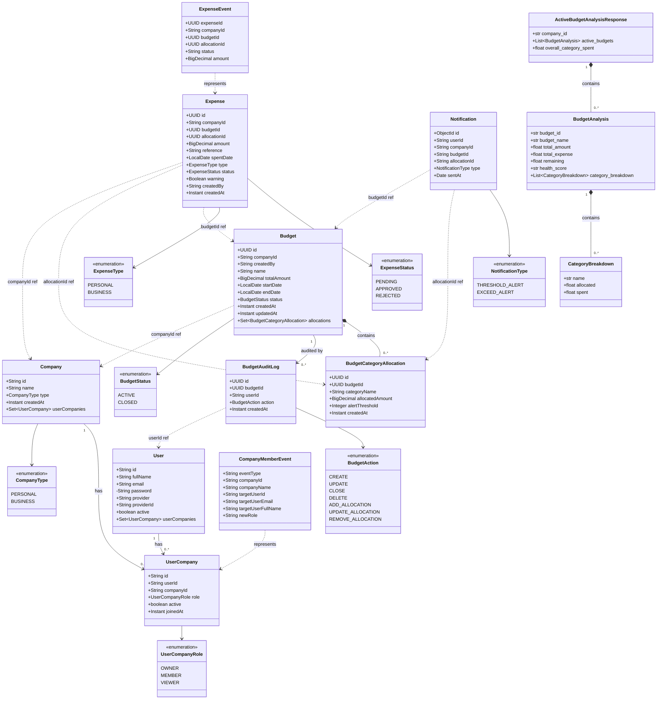

```mermaid
classDiagram

    %% ═══════════════════════════════════════════════════════════
    %%  ENUMERATIONS
    %% ═══════════════════════════════════════════════════════════
    class UserCompanyRole {
        <<enumeration>>
        OWNER
        MEMBER
        VIEWER
    }
    class CompanyType {
        <<enumeration>>
        PERSONAL
        BUSINESS
    }
    class BudgetStatus {
        <<enumeration>>
        ACTIVE
        CLOSED
    }
    class BudgetAction {
        <<enumeration>>
        CREATE
        UPDATE
        CLOSE
        DELETE
        ADD_ALLOCATION
        UPDATE_ALLOCATION
        REMOVE_ALLOCATION
    }
    class ExpenseStatus {
        <<enumeration>>
        PENDING
        APPROVED
        REJECTED
    }
    class ExpenseType {
        <<enumeration>>
        PERSONAL
        BUSINESS
    }
    class NotificationType {
        <<enumeration>>
        THRESHOLD_ALERT
        EXCEED_ALERT
    }

    %% ═══════════════════════════════════════════════════════════
    %%  USER-SERVICE  ─  Models
    %% ═══════════════════════════════════════════════════════════
    class User {
        +String id
        +String fullName
        +String email
        -String password
        +String provider
        +String providerId
        +boolean active
        +Set~UserCompany~ userCompanies
    }
    class Company {
        +String id
        +String name
        +CompanyType type
        +Instant createdAt
        +Set~UserCompany~ userCompanies
    }
    class UserCompany {
        +String id
        +String userId
        +String companyId
        +UserCompanyRole role
        +boolean active
        +Instant joinedAt
    }

    User "1" --> "0..*" UserCompany : has
    Company "1" --> "0..*" UserCompany : has
    UserCompany --> UserCompanyRole
    Company --> CompanyType

    %% ═══════════════════════════════════════════════════════════
    %%  BUDGET-SERVICE  ─  Models
    %% ═══════════════════════════════════════════════════════════
    class Budget {
        +UUID id
        +String companyId
        +String createdBy
        +String name
        +BigDecimal totalAmount
        +LocalDate startDate
        +LocalDate endDate
        +BudgetStatus status
        +Instant createdAt
        +Instant updatedAt
        +Set~BudgetCategoryAllocation~ allocations
    }
    class BudgetCategoryAllocation {
        +UUID id
        +UUID budgetId
        +String categoryName
        +BigDecimal allocatedAmount
        +Integer alertThreshold
        +Instant createdAt
    }
    class BudgetAuditLog {
        +UUID id
        +UUID budgetId
        +String userId
        +BudgetAction action
        +Instant createdAt
    }

    Budget "1" *-- "0..*" BudgetCategoryAllocation : contains
    Budget "1" --> "0..*" BudgetAuditLog : audited by
    Budget --> BudgetStatus
    BudgetAuditLog --> BudgetAction

    %% ═══════════════════════════════════════════════════════════
    %%  EXPENSE-SERVICE  ─  Models
    %% ═══════════════════════════════════════════════════════════
    class Expense {
        +UUID id
        +String companyId
        +UUID budgetId
        +UUID allocationId
        +BigDecimal amount
        +String reference
        +LocalDate spentDate
        +ExpenseType type
        +ExpenseStatus status
        +Boolean warning
        +String createdBy
        +Instant createdAt
    }

    Expense --> ExpenseStatus
    Expense --> ExpenseType

    %% ═══════════════════════════════════════════════════════════
    %%  NOTIFICATION-SERVICE  ─  Models  (MongoDB)
    %% ═══════════════════════════════════════════════════════════
    class Notification {
        +ObjectId id
        +String userId
        +String companyId
        +String budgetId
        +String allocationId
        +NotificationType type
        +Date sentAt
    }

    Notification --> NotificationType

    %% ═══════════════════════════════════════════════════════════
    %%  ANALYSIS-SERVICE  ─  Models  (Pydantic / FastAPI)
    %% ═══════════════════════════════════════════════════════════
    class CategoryBreakdown {
        +str name
        +float allocated
        +float spent
    }
    class BudgetAnalysis {
        +str budget_id
        +str budget_name
        +float total_amount
        +float total_expense
        +float remaining
        +str health_score
        +List~CategoryBreakdown~ category_breakdown
    }
    class ActiveBudgetAnalysisResponse {
        +str company_id
        +List~BudgetAnalysis~ active_budgets
        +float overall_category_spent
    }

    ActiveBudgetAnalysisResponse "1" *-- "0..*" BudgetAnalysis : contains
    BudgetAnalysis "1" *-- "0..*" CategoryBreakdown : contains

    %% ═══════════════════════════════════════════════════════════
    %%  KAFKA EVENT CONTRACTS  (cross-service messages)
    %% ═══════════════════════════════════════════════════════════
    class CompanyMemberEvent {
        +String eventType
        +String companyId
        +String companyName
        +String targetUserId
        +String targetUserEmail
        +String targetUserFullName
        +String newRole
    }
    class ExpenseEvent {
        +UUID expenseId
        +String companyId
        +UUID budgetId
        +UUID allocationId
        +String status
        +BigDecimal amount
    }

    %% ─── Cross-service logical references (dashed) ───
    Expense ..> Budget                      : budgetId ref
    Expense ..> BudgetCategoryAllocation    : allocationId ref
    Expense ..> Company                     : companyId ref
    Notification ..> BudgetCategoryAllocation : allocationId ref
    Notification ..> Budget                 : budgetId ref
    Budget ..> Company                      : companyId ref
    BudgetAuditLog ..> User                 : userId ref
    ExpenseEvent ..> Expense                : represents
    CompanyMemberEvent ..> UserCompany      : represents
```
