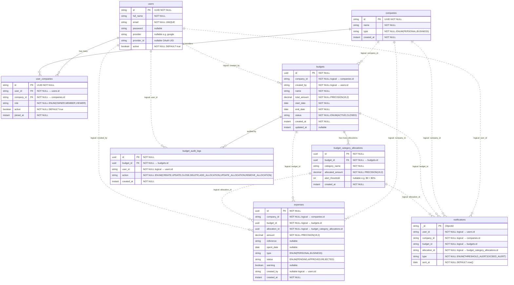

```mermaid
erDiagram
    %% ══════════════════════════════════════════
    %%  USER-SERVICE DB  (PostgreSQL)
    %% ══════════════════════════════════════════
    users {
        string  id          PK  "UUID NOT NULL"
        string  full_name       "NOT NULL"
        string  email           "NOT NULL UNIQUE"
        string  password        "nullable"
        string  provider        "nullable  e.g. google"
        string  provider_id     "nullable  OAuth UID"
        boolean active          "NOT NULL DEFAULT true"
    }

    companies {
        string  id          PK  "UUID NOT NULL"
        string  name            "NOT NULL"
        string  type            "NOT NULL  ENUM(PERSONAL,BUSINESS)"
        instant created_at      "NOT NULL"
    }

    user_companies {
        string  id          PK  "UUID NOT NULL"
        string  user_id     FK  "NOT NULL → users.id"
        string  company_id  FK  "NOT NULL → companies.id"
        string  role            "NOT NULL  ENUM(OWNER,MEMBER,VIEWER)"
        boolean active          "NOT NULL DEFAULT true"
        instant joined_at       "NOT NULL"
    }

    %% ══════════════════════════════════════════
    %%  BUDGET-SERVICE DB  (PostgreSQL)
    %% ══════════════════════════════════════════
    budgets {
        uuid    id          PK  "NOT NULL"
        string  company_id      "NOT NULL  logical → companies.id"
        string  created_by      "NOT NULL  logical → users.id"
        string  name            "NOT NULL"
        decimal total_amount    "NOT NULL PRECISION(19,2)"
        date    start_date      "NOT NULL"
        date    end_date        "NOT NULL"
        string  status          "NOT NULL  ENUM(ACTIVE,CLOSED)"
        instant created_at      "NOT NULL"
        instant updated_at      "nullable"
    }

    budget_category_allocations {
        uuid    id              PK  "NOT NULL"
        uuid    budget_id       FK  "NOT NULL → budgets.id"
        string  category_name       "NOT NULL"
        decimal allocated_amount    "NOT NULL PRECISION(19,2)"
        int     alert_threshold     "nullable  e.g. 80 = 80%"
        instant created_at          "NOT NULL"
    }

    budget_audit_logs {
        uuid    id          PK  "NOT NULL"
        uuid    budget_id   FK  "NOT NULL → budgets.id"
        string  user_id         "NOT NULL  logical → users.id"
        string  action          "NOT NULL  ENUM(CREATE,UPDATE,CLOSE,DELETE,ADD_ALLOCATION,UPDATE_ALLOCATION,REMOVE_ALLOCATION)"
        instant created_at      "NOT NULL"
    }

    %% ══════════════════════════════════════════
    %%  EXPENSE-SERVICE DB  (PostgreSQL)
    %% ══════════════════════════════════════════
    expenses {
        uuid    id              PK  "NOT NULL"
        string  company_id          "NOT NULL  logical → companies.id"
        uuid    budget_id           "NOT NULL  logical → budgets.id"
        uuid    allocation_id       "NOT NULL  logical → budget_category_allocations.id"
        decimal amount              "NOT NULL PRECISION(19,2)"
        string  reference           "nullable"
        date    spent_date          "nullable"
        string  type                "ENUM(PERSONAL,BUSINESS)"
        string  status              "ENUM(PENDING,APPROVED,REJECTED)"
        boolean warning             "nullable"
        string  created_by          "nullable  logical → users.id"
        instant created_at          "NOT NULL"
    }

    %% ══════════════════════════════════════════
    %%  NOTIFICATION-SERVICE DB  (MongoDB)
    %% ══════════════════════════════════════════
    notifications {
        string  _id             PK  "ObjectId"
        string  user_id             "NOT NULL  logical → users.id"
        string  company_id          "NOT NULL  logical → companies.id"
        string  budget_id           "NOT NULL  logical → budgets.id"
        string  allocation_id       "NOT NULL  logical → budget_category_allocations.id"
        string  type                "NOT NULL  ENUM(THRESHOLD_ALERT,EXCEED_ALERT)"
        date    sent_at             "NOT NULL DEFAULT now()"
    }

    %% ══════════════════════════════════════════
    %%  PHYSICAL FOREIGN KEYS  (solid lines — same DB)
    %% ══════════════════════════════════════════
    users               ||--o{ user_companies               : "has many"
    companies           ||--o{ user_companies               : "has many members"
    budgets             ||--o{ budget_category_allocations  : "has many allocations"
    budgets             ||--o{ budget_audit_logs            : "audited by"

    %% ══════════════════════════════════════════
    %%  LOGICAL / CROSS-SERVICE REFERENCES  (dashed lines)
    %% ══════════════════════════════════════════
    companies           ||..o{ budgets                      : "logical: company_id"
    users               ||..o{ budgets                      : "logical: created_by"
    users               ||..o{ budget_audit_logs            : "logical: user_id"
    companies           ||..o{ expenses                     : "logical: company_id"
    budgets             ||..o{ expenses                     : "logical: budget_id"
    budget_category_allocations ||..o{ expenses             : "logical: allocation_id"
    users               ||..o{ expenses                     : "logical: created_by"
    users               ||..o{ notifications                : "logical: user_id"
    companies           ||..o{ notifications                : "logical: company_id"
    budgets             ||..o{ notifications                : "logical: budget_id"
    budget_category_allocations ||..o{ notifications        : "logical: allocation_id"
```
