# 📊 Artha Unified Entity-Relationship Diagram

This document contains the consolidated database schemas for all services in the Artha microservices ecosystem. It maps out **physical schemas** (PostgreSQL databases with physical foreign keys) and **logical schemas** (MongoDB collections and cross-database references linked by Kafka events).

---

## 1. Consolidated ER Diagram (Mermaid)

```mermaid
erDiagram
    %% ══════════════════════════════════════════
    %%  USER-SERVICE DB (PostgreSQL - Core)
    %% ══════════════════════════════════════════
    users {
        string  id          PK  "UUID NOT NULL"
        string  full_name       "NOT NULL"
        string  email           "NOT NULL UNIQUE"
        string  password        "nullable"
        string  provider        "nullable (e.g. google)"
        string  provider_id     "nullable (OAuth UID)"
        boolean active          "NOT NULL DEFAULT true"
    }

    companies {
        string  id          PK  "UUID NOT NULL"
        string  name            "NOT NULL"
        string  type            "NOT NULL ENUM(PERSONAL, BUSINESS)"
        instant created_at      "NOT NULL"
    }

    user_companies {
        string  id          PK  "UUID NOT NULL"
        string  user_id     FK  "NOT NULL → users.id"
        string  company_id  FK  "NOT NULL → companies.id"
        string  role            "NOT NULL ENUM(OWNER, MEMBER, VIEWER)"
        boolean active          "NOT NULL DEFAULT true"
        instant joined_at       "NOT NULL"
    }

    %% ══════════════════════════════════════════
    %%  BUDGET-SERVICE DB (PostgreSQL - Core)
    %% ══════════════════════════════════════════
    budgets {
        uuid    id          PK  "NOT NULL"
        string  company_id      "NOT NULL (logical → companies.id)"
        string  created_by      "NOT NULL (logical → users.id)"
        string  name            "NOT NULL"
        decimal total_amount    "NOT NULL PRECISION(19,2)"
        date    start_date      "NOT NULL"
        date    end_date        "NOT NULL"
        string  status          "NOT NULL ENUM(ACTIVE, CLOSED)"
        instant created_at      "NOT NULL"
        instant updated_at      "nullable"
    }

    budget_category_allocations {
        uuid    id              PK  "NOT NULL"
        uuid    budget_id       FK  "NOT NULL → budgets.id"
        string  category_name       "NOT NULL"
        decimal allocated_amount    "NOT NULL PRECISION(19,2)"
        int     alert_threshold     "nullable (e.g. 80 = 80%)"
        instant created_at          "NOT NULL"
    }

    budget_audit_logs {
        uuid    id          PK  "NOT NULL"
        uuid    budget_id   FK  "NOT NULL → budgets.id"
        string  user_id         "NOT NULL (logical → users.id)"
        string  action          "NOT NULL ENUM(CREATE, UPDATE, CLOSE, DELETE, ADD_ALLOCATION, ...)"
        instant created_at      "NOT NULL"
    }

    %% ══════════════════════════════════════════
    %%  EXPENSE-SERVICE DB (PostgreSQL - Core)
    %% ══════════════════════════════════════════
    expenses {
        uuid    id              PK  "NOT NULL"
        string  company_id          "NOT NULL (logical → companies.id)"
        uuid    budget_id           "NOT NULL (logical → budgets.id)"
        uuid    allocation_id       "NOT NULL (logical → budget_category_allocations.id)"
        decimal amount              "NOT NULL PRECISION(19,2)"
        string  reference           "nullable"
        date    spent_date          "nullable"
        string  type                "ENUM(PERSONAL, BUSINESS)"
        string  status              "ENUM(PENDING, APPROVED, REJECTED)"
        boolean warning             "nullable"
        string  created_by          "nullable (logical → users.id)"
        instant created_at          "NOT NULL"
    }

    %% ══════════════════════════════════════════
    %%  NOTIFICATION-SERVICE DB (MongoDB)
    %% ══════════════════════════════════════════
    notifications {
        string  _id             PK  "ObjectId"
        string  userId              "NOT NULL (logical → users.id)"
        string  companyId           "NOT NULL (logical → companies.id)"
        string  budgetId            "NOT NULL (logical → budgets.id)"
        string  allocationId        "NOT NULL (logical → budget_category_allocations.id)"
        string  type                "NOT NULL ENUM(THRESHOLD_ALERT, EXCEED_ALERT)"
        date    sentAt              "NOT NULL DEFAULT now()"
    }

    %% ══════════════════════════════════════════
    %%  ANALYSIS-SERVICE DB (MongoDB)
    %% ══════════════════════════════════════════
    budget_expenses {
        string  budget_id       PK  "string (logical → budgets.id)"
        string  company_id          "string (logical → companies.id)"
        double  total_approved_amount "double"
        array   expense_history     "Array of expense objects"
    }

    budget_metadata {
        string  id              PK  "string (maps to budget_id or allocation_id)"
        string  companyId           "string"
        string  budgetId            "string"
        string  eventType           "string (e.g. BUDGET_CREATED, ALLOCATION_UPDATED)"
    }

    %% ══════════════════════════════════════════
    %%  PHYSICAL FOREIGN KEYS (Solid Lines)
    %% ══════════════════════════════════════════
    users               ||--o{ user_companies               : "has many"
    companies           ||--o{ user_companies               : "has many members"
    budgets             ||--o{ budget_category_allocations  : "has many allocations"
    budgets             ||--o{ budget_audit_logs            : "audited by"

    %% ══════════════════════════════════════════
    %%  LOGICAL / CROSS-SERVICE REFERENCES (Dashed Lines)
    %% ══════════════════════════════════════════
    companies           ||..o{ budgets                      : "logical: company_id"
    users               ||..o{ budgets                      : "logical: created_by"
    users               ||..o{ budget_audit_logs            : "logical: user_id"
    companies           ||..o{ expenses                     : "logical: company_id"
    budgets             ||..o{ expenses                     : "logical: budget_id"
    budget_category_allocations ||..o{ expenses             : "logical: allocation_id"
    users               ||..o{ expenses                     : "logical: created_by"
    
    users               ||..o{ notifications                : "event-driven: userId"
    companies           ||..o{ notifications                : "event-driven: companyId"
    budgets             ||..o{ notifications                : "event-driven: budgetId"
    budget_category_allocations ||..o{ notifications        : "event-driven: allocationId"
    
    budgets             ||..o{ budget_expenses              : "denormalized: budget_id"
    companies           ||..o{ budget_expenses              : "denormalized: company_id"
    budgets             ||..o{ budget_metadata              : "denormalized: id/budgetId"
```

---

## 2. Database Partitioning & Schemas

### 2.1 Core Services (PostgreSQL)
Core services store structured data requiring strict relational integrity, transactions, and unique key constraint checks.
1. **User Service Database**: Manages `users`, `companies`, and membership mapping (`user_companies`).
2. **Budget Service Database**: Manages company budgets, allocations per budget category, and budget modification audit history.
3. **Expense Service Database**: Manages employee/company expenses and workflow states (Pending, Approved, Rejected).

### 2.2 Notification Service (MongoDB)
* **Collection**: `notifications`
* **Purpose**: Tracks threshold alert dispatches. Uses a compound unique index on `{ allocationId: 1, type: 1 }` to prevent double-notifying on the same limit trigger.

### 2.3 Analysis Service (MongoDB & Redis Cache)
* **Collection**: `budget_expenses`
  - Stores a denormalized view of budgets with their approved expenses for fast, aggregation-free chart fetches.
  - Contains `expense_history` array embedded inside the parent budget document.
* **Collection**: `budget_metadata`
  - Stores raw event payloads received via Kafka for sync tracking.
* **Cache (Redis)**: Caches processed analytics responses. Invalidation is managed dynamically when expense/budget events arrive on Kafka topics.
