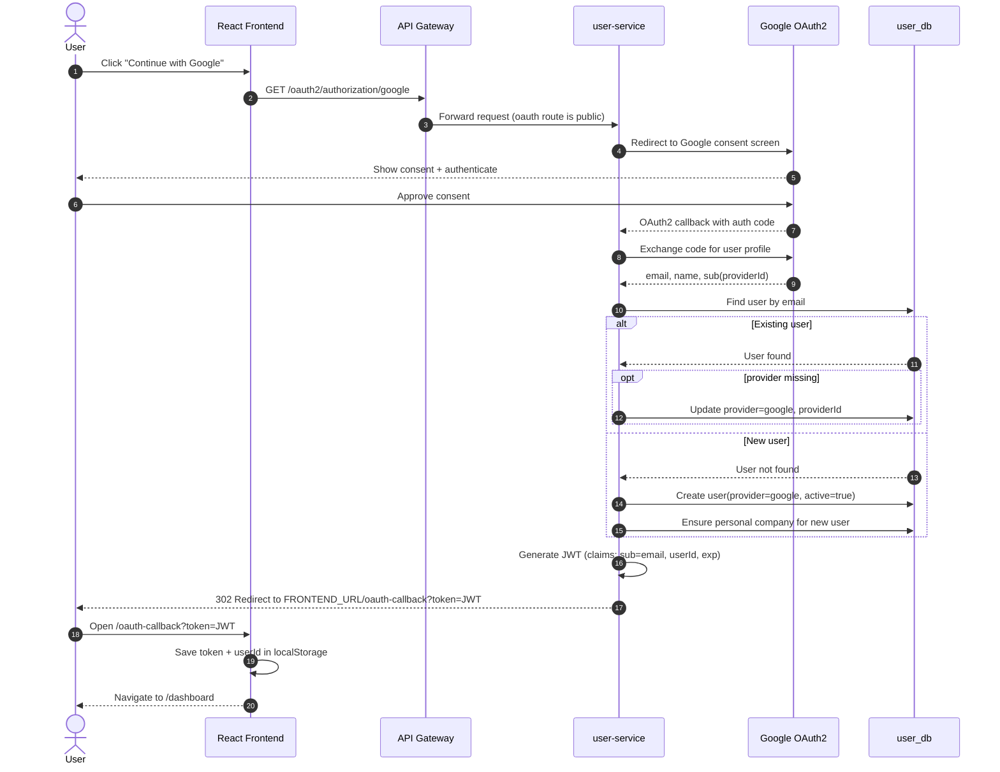
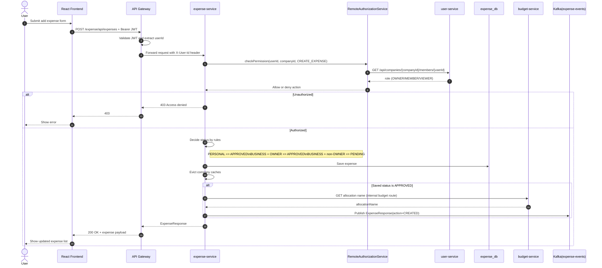

## 3.3 Sequence diagrams

### OAuth (Google login)



### Add new expense



## 3.4 Activity diagrams

### JWT signup flow

```mermaid
flowchart TD
    A([Start]) --> B[User submits signup form]
    B --> C[POST /auth/signup]
    C --> D{Email already exists?}
    D -- Yes --> E[Return error: Email already in use]
    E --> Z([End])
    D -- No --> F[Encode password]
    F --> G[Create user record]
    G --> H[Ensure personal company]
    H --> I[Return SignupResponse{id,email}]
    I --> J[Frontend optionally calls /auth/login]
    J --> Z
```

### JWT login flow

```mermaid
flowchart TD
    A([Start]) --> B[User submits login form]
    B --> C[POST /auth/login]
    C --> D[Authenticate email+password]
    D --> E{Credentials valid?}
    E -- No --> F[401 Unauthorized]
    F --> Z([End])
    E -- Yes --> G[Load user by email]
    G --> H[Generate JWT with sub=email + userId + exp]
    H --> I[Return LoginResponse{jwt,userId}]
    I --> J[Frontend stores JWT in localStorage]
    J --> K[Subsequent API calls send Bearer token]
    K --> L[Gateway validates JWT]
    L --> M[Gateway forwards X-User-Id to services]
    M --> Z
```
